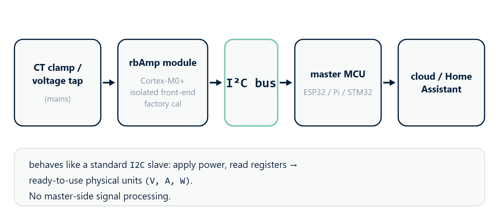

# 01 · Overview



## What rbAmp is

**rbAmp** is a compact hardware module for precision measurement of
AC mains parameters over the I²C interface. It is built on a
Cortex M0+ microcontroller with an integrated isolated analog
front-end and factory calibration stored in flash.

From an integrator's point of view the module behaves like a standard
I²C slave: you create `RbAmp(bus, 0x50)`, call `dev.begin()`, and
get ready-to-use values through properties / methods. The same
source runs on **MicroPython** (with `machine.I2C`) and **CPython**
(with `smbus2`) — the backend is selected automatically from the
type of the bus object.

## The library's main purpose — monitoring multiple loads

The `rbamp` Python package is designed **for working with a group of
modules simultaneously** on a single I²C bus, not for controlling a
single device. The canonical scenario is **one master module at the
mains feed plus N modules on individual loads**, all on one bus,
driven by a single ESP32 / RPi / SBC. The library provides the
**`RbAmpFleet`** class — a single object through which you scan the
bus, poll all modules in one call, get total power and the
"feed − Σ(consumers)" balance, catch errors on each module, and, when
needed, synchronize period snapshots with a broadcast command.

**Multi-channel** modules are also supported (`I2`, `I3` — two or
three CTs on one module, each with its own sensor model). This is
typical for a sub-panel, where a single installation point monitors
several feeders.

Working with a **single** module is the minimal case of the same
library: the `RbAmp` class is the building block on which
`RbAmpFleet` is layered. If you have one module on the bus, you use
that same handle directly — the fleet API is not needed.

## The 80% scenario — mains + N sub-loads

```text
                              ┌──────────────────────────┐
                              │   ESP32 / RPi / SBC      │
                              │   RbAmpFleet(bus)        │
                              └──┬─────────┬─────────┬───┘
                                 │   I²C (shared bus)
        ┌────────────────────────┘         │         │
        │                                  │         │
   ┌────▼─────┐                     ┌──────▼────┐    │
   │ rbAmp #1 │                     │ rbAmp #2  │    │
   │ MAINS    │                     │ Boiler    │    │
   │ 0x50     │                     │ 0x51      │    │
   └──────────┘                     └───────────┘    │
        │ (at the feed)             (load 1)         │
                                                     │
                                               ┌─────▼─────┐
                                               │ rbAmp #3  │
                                               │ A/C       │
                                               │ 0x52      │
                                               └───────────┘
                                              (load 2)
```

- 1 module at the feed (mains) — total consumption and grid quality.
- N modules on individual loads — per-channel metering.
- A single `fleet.poll_all()` call polls everything; the balance
  `mains − Σ(sub_loads)` shows "the rest" (background consumption,
  unmetered loads, leakage).
- One shared master timestamp → correct Wh metering with no
  inter-module drift.

> **Important architectural detail.** The I-variants (`I1`/`I2`/`I3`)
> measure **current only** — they have no voltage, active power, or
> PF. Active energy (Wh) and power are computed **only on the
> UI-variants** (which have a voltage front-end). In the canonical
> deployment, the "mains-meter" role (billing energy) is played by a
> single **UI1** at the mains feed; the sub-meter role (per-load
> current detail) is played by **I2**/**I3** modules.

For details, see chapter **06 · Examples**, scenario 1
("Mains + N sub-loads — the 80% canon"). For the API, see chapter
**09 · API Reference**, section "Fleet manager".

## What rbAmp measures

| Quantity | Python type | Range |
|---|---|---|
| RMS voltage U_rms | `float`, V | 0…300 V |
| Peak voltage U_peak | `float`, V | 0…450 V |
| RMS current I_rms | `float`, A | depends on the selected sensor — see [03_sensor_selection.md](03_sensor_selection.md) |
| Peak current I_peak | `float`, A | depends on the selected sensor |
| Active power P (signed in RT) | `float`, W | depends on the selected sensor |
| Power factor PF | `float` | −1…+1 |
| Mains frequency | `int`, Hz | 45…65 Hz |
| Period-averaged P | `float`, W | same as P |

> **The RT value of active power `P` is always signed on any module
> tier** (negative means export to the grid). The behavior of the
> period-averaged value (`snap.avg_p[ch]` in `RbAmpPeriodSnapshot`)
> **depends on the module tier** — see the "Module tiers" section
> below and [02_tiers.md](02_tiers.md).

## Wiring

The module connects to the host with four wires on the LV side. The
mains side is already routed inside the enclosure and is galvanically
isolated.

| Wire | Purpose |
|---|---|
| `VCC` | **+5 V (4.5..5.5 V)**, current ~15 mA, peak ~25 mA |
| `GND` | common with the host (**required**) |
| `SDA`, `SCL` | I²C, **3.3 V logic, 5 V-tolerant**. Built-in pull-ups 4.7 kΩ |
| `DRDY` | optional, open-drain LOW ~10 µs every ~200 ms |

The default address is `0x50` (7-bit, change range `0x08..0x77`).
The recommended speed for MicroPython on ESP32 is **50 kHz**; for
CPython through the kernel I²C it is usually **100 kHz** (the NACK
pattern does not appear through the Linux kernel API).

The full rules (bus length, pull-up recommendations on a
multi-module bus, wiring diagrams for RPi / ESP32 / RP2040 / STM32)
are in chapter [04 · Wiring](04_hardware.md).

## Module tiers (quick cheat sheet)

The current rbAmp firmware implements only the **BASIC** tier —
one-directional (consumption-only) metering following the logic of a
classic mechanical meter:

| Tier | RT power `dev.power[ch]` | Period accumulator `snap.avg_p[ch]` | Package Wh counter |
|---|---|---|---|
| **BASIC** | signed (negative = export to the grid, visible in real time) | each **200 ms window** of average P is clamped to `max(P, 0)` before being added to the period accumulator | **monotonic** — consumption-only metering |
| **STANDARD** | *planned for a future tier release* | *planned* — separate export accumulator | *planned* — bidirectional metering |
| **PRO** | *planned for a future tier release* | *planned* + diagnostics | *planned* + additional counters |

For details, see chapter [02 · Module tiers](02_tiers.md). At the
package level the same `RbAmp` class is used regardless of tier; the
differences show up in the values the module returns.

> **Bidirectional metering on BASIC**: `dev.energy.wh(ch)` on the
> BASIC tier gives consumption only. If you need to account for
> export separately, sample the RT power `dev.power[0]` (or
> `dev.read_power(0)`) at ~5 Hz and split the positive and negative
> samples into two accumulator variables yourself. For an example,
> see [06_examples.md](06_examples.md), scenario "Bidirectional
> metering on the master side".

## What this package does

The main job is to hide the protocol exchange and relieve user code
of the routine of working with registers, byte order, and settle
times after commands. In addition, the package **computes energy
(Wh)** — the module returns only the period-averaged power, and the
master does the integration using `time.monotonic()` /
`time.ticks_us()`.

### Without the package (direct register access via `smbus2`)

```python
import struct
from smbus2 import SMBus, i2c_msg

# Read U_RMS — burst-read 4 bytes (auto-increment is supported on reads).
with SMBus(1) as bus:
    buf = bytes(bus.read_i2c_block_data(0x50, 0x86, 4))
u_rms = struct.unpack("<f", bytes(buf))[0]
```

### With the package

```python
from smbus2 import SMBus
from rbamp import RbAmp

with SMBus(1) as bus, RbAmp(bus, 0x50) as dev:
    dev.begin()
    u_rms = dev.voltage          # property (one call = one transaction)
    # or: u_rms = dev.read_voltage()
```

### Reading a period — without the package

```python
import time, struct

with SMBus(1) as bus:
    # Latch + 50 ms settle + ready-flag check + assemble 4 bytes of avg_p
    bus.write_byte_data(0x50, 0x01, 0x27)   # REG_COMMAND, CMD_LATCH_PERIOD
    t_latch = time.monotonic()
    time.sleep(0.050)                        # settle

    bus.write_byte(0x50, 0x07)
    if bus.read_byte(0x50) & 0x01 == 0:
        # snapshot is stale — t_latch STILL must be recorded,
        # otherwise the next snapshot will count Wh over two periods
        return

    # ...read 4 bytes of avg_p, struct.unpack, integrate Wh:
    #   dt_s = time.monotonic() - t_prev_latch
    #   E_Wh += avg_p * dt_s / 3600
```

### Reading a period — with the package

```python
with SMBus(1) as bus, RbAmp(bus, 0x50) as dev:
    dev.begin()
    snap = dev.read_period_snapshot()        # latch + settle + valid + read + Wh tick
    print(snap.avg_p[0], "W")
    print(dev.energy.wh(0), "Wh")
```

Internally the package guarantees:

- A 50 ms settle after `CMD_LATCH_PERIOD`, and a correct snapshot read.
- A `valid` flag check before reading; on a stale snapshot it raises
  `RbAmpStaleError`.
- Recording the time by the master clock even on a stale snapshot
  (which protects against double-counting Wh on the next period).
- Per-channel Wh accumulation in double precision (CPython — 64-bit
  `float`; MicroPython — depends on the build, see
  [04 · Wiring](04_hardware.md)).
- Automatic loading of calibration coefficients when the current
  sensor is selected via `dev.set_sensor_class(cls)` +
  `dev.set_ct_model(code)` — the user does not need to know about
  the internal calibration registers.

## When to use the package, when to use direct bus access

| Task | Package | Direct access via `smbus2` / `machine.I2C` |
|---|---|---|
| Reading U / I / P / PF / frequency | ✅ | only for debugging on a logic analyzer |
| Per-period energy metering | ✅ | only if Wh are stored outside the package (e.g., in a DB on the master side) |
| Several modules on one bus | ✅ (via sequential LATCH + shared settle) | — |
| Bidirectional metering on BASIC | ✅ (via RT sampling — see [06_examples.md](06_examples.md)) | alternative — your own RT-read loop |
| Async streaming via asyncio / uasyncio | ✅ (`async for snap in dev.stream_period()`) | hard — no built-in async wrapper |
| Porting to another platform | n/a | ✅ — see [`rbamp-spec`](https://github.com/rb-amp/rbamp-spec) |

For all the typical tasks in the first rows, the package is the way to go.

## Architecture

```text
┌─────────────────────────────────────────────────────┐
│  User code (.py)                                    │
│   from smbus2 import SMBus                          │
│   from rbamp import RbAmp, RbAmpSensorClass         │
│   with SMBus(1) as bus, RbAmp(bus, 0x50) as dev:    │
│       # __enter__ calls dev.begin() itself;         │
│       # explicit begin() shown for transparency     │
│       dev.set_sensor_class(RbAmpSensorClass.SCT_013)│
│       dev.set_ct_model(3)                           │
│       snap = dev.read_period_snapshot()             │
│       dev.energy.wh(0)                              │
└─────────────────────────────────────────────────────┘
                       │
                       ▼
┌─────────────────────────────────────────────────────┐
│  Public API of the RbAmp class (rbamp/__init__.py)  │
│   ┌─────────────────────────────────────────────┐   │
│   │ Lifecycle:      begin / probe / wait_ready  │   │
│   │ RT properties:  .voltage / .power[ch] /     │   │
│   │                 .current[ch] / .frequency   │   │
│   │ RT methods:     read_voltage / read_power / │   │
│   │                 read_all                    │   │
│   │ Period:         latch_period /              │   │
│   │                 read_period_snapshot        │   │
│   │ Async:          stream_period               │   │
│   │ Configuration:  set_sensor_class /          │   │
│   │                 set_ct_model                │   │
│   │ Diagnostics:    retry_exhaustion_count /    │   │
│   │                 sanity_reject_count         │   │
│   │ Exceptions:     RbAmpError → IOError /      │   │
│   │                 TimeoutError / StaleError / │   │
│   │                 ParamError / ModeError /    │   │
│   │                 VersionError                │   │
│   └─────────────────────────────────────────────┘   │
│                       │                             │
│                       ▼                             │
│   ┌─────────────────────────────────────────────┐   │
│   │ Backend selection (inside __init__):        │   │
│   │  bus.readfrom_mem  → MachineI2CBackend      │   │
│   │  bus.read_byte_data → SMBusBackend          │   │
│   │  duck-typed        → custom (FTDI / mocks)  │   │
│   └─────────────────────────────────────────────┘   │
│                       │                             │
│                       ▼                             │
│   ┌─────────────────────────────────────────────┐   │
│   │ Instance state:                             │   │
│   │  • RbAmpEnergy — Wh accumulator             │   │
│   │  • RbAmpSnapshot / RbAmpPeriodSnapshot      │   │
│   │  • Time of last latch (monotonic)           │   │
│   └─────────────────────────────────────────────┘   │
└─────────────────────────────────────────────────────┘
                       │
                       ▼
┌─────────────────────────────────────────────────────┐
│  Backend — native I²C on the host platform:         │
│   smbus2 (CPython)  /  machine.I2C (MicroPython)    │
└─────────────────────────────────────────────────────┘
                       │
                       ▼
┌─────────────────────────────────────────────────────┐
│  rbAmp module at address 0x50                       │
│   • U / I / P / PF measurement pipeline (~200 ms)   │
│   • Period accumulator (atomic CMD_LATCH_PERIOD)    │
└─────────────────────────────────────────────────────┘
```

## Exception hierarchy

Unlike the Arduino library (where errors are reported via
`lastError()` + a return code) and the ESP-IDF component (where they
are reported via `esp_err_t`), the Python package uses the
**classic Python pattern** — an exception hierarchy.

```text
RbAmpError
├── RbAmpIOError         — I²C transport error (NACK after retry, bus glitch)
├── RbAmpTimeoutError    — timeout (waitReady expired / commit_address_change window)
├── RbAmpNotReadyError   — device not ready (reserved)
├── RbAmpStaleError      — period snapshot not ready (valid flag = 0)
├── RbAmpParamError      — invalid argument (channel out of range, code not in per-class accept-set)
├── RbAmpModeError       — operation requires develop mode
└── RbAmpVersionError    — incompatible firmware version (or REG_VERSION = 0/0xFF)
```

The standard Python pattern:

```python
from rbamp import RbAmp, RbAmpStaleError, RbAmpError

try:
    snap = dev.read_period_snapshot()
except RbAmpStaleError:
    # Snapshot is stale — the master timestamp has already been recorded by the package
    continue
except RbAmpError as e:
    log.warning("rbAmp failure: %s", e)
```

## Interaction diagrams

### The `dev.begin()` flow

```text
code          RbAmp                Backend             rbAmp module
  │             │                    │                       │
  ├─dev.begin()►                     │                       │
  │             ├─read_u8(REG_VERSION)►                      │
  │             │                    ├──[0x50, 0x03]────────►│
  │             │                    │◄────────────────ACK───┤
  │             │                    ├──[read 1 byte]───────►│
  │             │                    │◄──────────────[0x04]──┤
  │             │◄─────── version_byte ─────┤                  │
  │             │                    │                       │
  │             ├─read_float_le(U_RMS)►(4 single-byte reads) │
  │             │  → 226.3 V         │                       │
  │             │  → has_voltage_hw = True                   │
  │             │                    │                       │
  │             ├─write_cmd(LATCH)──►│                       │
  │             │                    ├──[0x50, 0x01, 0x27]──►│
  │             │  sleep(50ms)       │                       │
  │             │                    │                       │
  │◄────self────┤  (or raises RbAmpIOError on failure)        │
```

The first latch is a primer (the module returns what it has
accumulated since power-on, which is unsuitable for tariff metering).
The package records on its own that this snapshot must be discarded —
user code never sees it.

### The `dev.read_period_snapshot()` flow

```text
code          RbAmp                Backend             rbAmp module
  │             │                    │                       │
  ├─read_period_snapshot()►          │                       │
  │             ├─write_cmd(LATCH)──►│  t_now = time.monotonic()
  │             │                    │                       │
  │             │  sleep(50ms)       │                       │
  │             │                    │                       │
  │             ├─is_period_valid()─►│                       │
  │             │  → True            │                       │
  │             │                    │                       │
  │             ├─read_float_le(AVG_P0)►(4 reads)            │
  │             ├─read_float_le(MAX_P0)►(4 reads)            │
  │             ├─read_u32_le(LATCH_MS)►(4 reads)            │
  │             │                    │                       │
  │             │  dt = t_now − last_latch                    │
  │             │  energy.wh[ch] += avg_p[ch] × dt / 3600    │
  │             │  last_latch = t_now                         │
  │             │                    │                       │
  │◄─snap──────┤                    │                       │
```

The atomic latch on the module side guarantees that every ADC
micro-sample within a period lands in exactly one snapshot — no
duplication, no losses at the period boundary.

## Mapping to the direct register API

A table for those migrating from their own direct-access work:

| Direct API (`smbus2` / `machine.I2C`) | Package equivalent |
|---|---|
| Manual 4-byte read + `struct.unpack` | `dev.voltage` (property) or `dev.read_voltage()` |
| Per-channel `read_byte` × 4 | `dev.power[ch]` (`_ChannelProxy`) or `dev.read_power(ch)` |
| `write_byte_data(0x50, 0x01, 0x27); time.sleep(0.05)` | `dev.latch_period(); time.sleep(0.05)` (or directly `dev.read_period_snapshot()`) |
| Checking `read_byte(0x07) & 1` | `dev.is_period_valid()` or the `snap.valid` field |
| Manual formula `E_Wh += avg_p × dt / 3600` | `dev.energy.wh(0)` — updated automatically |
| Manual current-sensor configuration via the direct register API | `dev.set_sensor_class(cls)` + `dev.set_ct_model(code)` — factory presets are loaded automatically |

## What's next

- [02 · Module tiers](02_tiers.md) — which tier for which task
- [04 · Wiring](04_hardware.md) — pull-ups, bus length,
  per-host wiring (RPi / ESP32 / RP2040 / STM32)
- [05 · Quickstart](05_quickstart.md) — the first working script for
  both backends
- [06 · Examples](06_examples.md) — a walkthrough of ready-made scenarios
- [09 · API Reference](09_api_reference.md) — every public class +
  method + property + exception
- [10 · Troubleshooting](10_troubleshooting.md) — when something doesn't work
