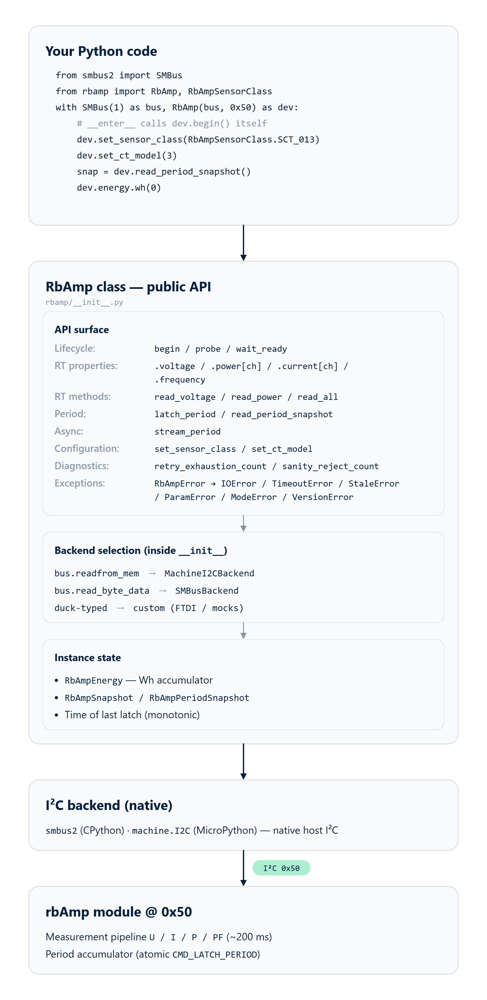
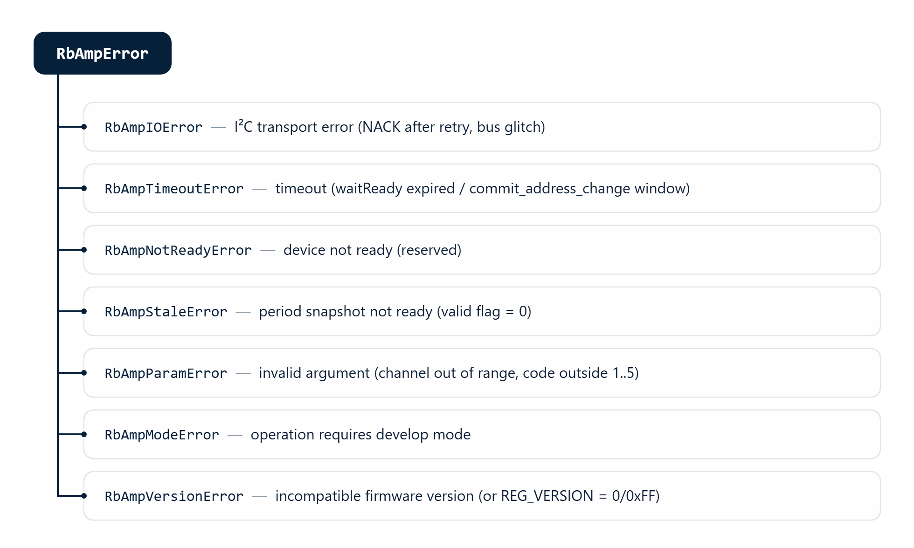

# 01 · Overview

## What rbAmp is

**rbAmp** is a compact hardware module for precision measurement of
AC mains parameters over the I²C interface. It is built on a
Cortex M0+ microcontroller with an integrated isolated analog
front-end and factory calibration stored in flash.

From an integrator's point of view, the module behaves like a
standard I²C slave: create `RbAmp(bus, 0x50)`, call `dev.begin()`,
and read the resulting values through properties and methods. The
exact same source runs on **MicroPython** (with `machine.I2C`) and
**CPython** (with `smbus2`) — the backend is selected automatically
from the type of the bus object.

## What rbAmp measures

| Quantity | Python type | Range |
|---|---|---|
| RMS voltage U_rms | `float`, V | 0…300 V |
| Peak voltage U_peak | `float`, V | 0…450 V |
| RMS current I_rms | `float`, A | depends on the selected sensor — see [03_sensor_selection.md](03_sensor_selection.md) |
| Peak current I_peak | `float`, A | depends on the selected sensor |
| Active power P (signed in RT) | `float`, W | depends on the selected sensor |
| Power factor PF | `float` | −1…+1 |
| Mains frequency | `int`, Hz | 45…65 Hz |
| Period-averaged P | `float`, W | same as P |

> **The RT value of active power `P` is always signed on every
> module tier** (negative means export to the grid). The behavior of
> the period-averaged value (`snap.avg_p[ch]` in
> `RbAmpPeriodSnapshot`) **depends on the module tier** — see the
> "Module tiers" section below and [02_tiers.md](02_tiers.md).

## Wiring

The module connects to the host with four wires on the LV side. The
mains side is already routed inside the enclosure and is galvanically
isolated.

| Wire | Purpose |
|---|---|
| `VCC` | **+5 V (4.5..5.5 V)**, ~15 mA, peak ~25 mA |
| `GND` | shared with the host (**mandatory**) |
| `SDA`, `SCL` | I²C, **3.3 V logic, 5 V tolerant**. Built-in 4.7 kΩ pull-ups |
| `DRDY` | optional, open-drain LOW for ~10 µs every ~200 ms |

The default address is `0x50` (7-bit, configurable in the range
`0x08..0x77`). The recommended speed for MicroPython on ESP32 is
**50 kHz** (SPEC §B.5); for CPython through the kernel I²C driver it
is usually **100 kHz** (the NACK pattern does not surface through the
Linux kernel API).

The full rules (bus length, pull-up recommendations for a
multi-module bus, wiring diagrams for RPi / ESP32 / RP2040 / STM32)
are in chapter [04 · Wiring](04_hardware.md).

## Module tiers (quick cheat sheet)

The current firmware (v1.2) implements only the **BASIC** tier —
one-directional (consumption-only) metering following the logic of a
classic mechanical meter:

| Tier | RT power `dev.power[ch]` | Per-period accumulator `snap.avg_p[ch]` | Wh counter in the package |
|---|---|---|---|
| **BASIC** | signed (negative = export to the grid, visible in real time) | every **200 ms window** of average P is clamped to `max(P, 0)` before being added to the period accumulator | **monotonic** — consumption only |
| **STANDARD** | *planned for v1.3+* | *planned* — separate export accumulator | *planned* — bidirectional metering |
| **PRO** | *planned for v1.3+* | *planned* + diagnostics | *planned* + additional counters |

For details, see chapter [02 · Module tiers](02_tiers.md). At the
package level the same `RbAmp` class is used regardless of tier; the
differences show up in the values the module returns.

> **Bidirectional metering on BASIC**: `dev.energy.wh(ch)` on the
> BASIC tier reports consumption only. If you need to account for
> export separately, sample the RT power `dev.power[0]` (or
> `dev.read_power(0)`) at about 5 Hz and split the positive and
> negative samples into two accumulator variables yourself. For an
> example, see [06_examples.md](06_examples.md), the scenario
> "Bidirectional metering on the master side".

## What this package does

Its main job is to hide the protocol exchange and to relieve user
code of the chores of working with registers, byte order, and the
settle times required after commands. In addition, the package
**computes energy (Wh)** — the module returns only the period-averaged
power, and the master does the integration using `time.monotonic()` /
`time.ticks_us()`.

### Without the package (direct register access via `smbus2`)

```python
import struct
from smbus2 import SMBus, i2c_msg

# Read U_RMS — assemble 4 bytes over 4 transactions (SPEC §6 — no auto-increment).
buf = bytearray(4)
with SMBus(1) as bus:
    for i in range(4):
        bus.write_byte(0x50, 0x86 + i)
        buf[i] = bus.read_byte(0x50)
u_rms = struct.unpack("<f", bytes(buf))[0]
```

### With the package

```python
from smbus2 import SMBus
from rbamp import RbAmp

with SMBus(1) as bus, RbAmp(bus, 0x50) as dev:
    dev.begin()
    u_rms = dev.voltage          # property (one call = one transaction)
    # or: u_rms = dev.read_voltage()
```

### Reading a period — without the package

```python
import time, struct

with SMBus(1) as bus:
    # Latch + 50 ms settle + ready-flag check + assemble 4 bytes of avg_p
    bus.write_byte_data(0x50, 0x01, 0x27)   # REG_COMMAND, CMD_LATCH_PERIOD
    t_latch = time.monotonic()
    time.sleep(0.050)                        # settle

    bus.write_byte(0x50, 0x07)
    if bus.read_byte(0x50) & 0x01 == 0:
        # snapshot is stale — t_latch STILL has to be recorded,
        # otherwise the next snapshot would tally Wh over two periods
        return

    # ...read 4 bytes of avg_p, struct.unpack, integrate Wh:
    #   dt_s = time.monotonic() - t_prev_latch
    #   E_Wh += avg_p * dt_s / 3600
```

### Reading a period — with the package

```python
with SMBus(1) as bus, RbAmp(bus, 0x50) as dev:
    dev.begin()
    snap = dev.read_period_snapshot()        # latch + settle + valid + read + Wh tick
    print(snap.avg_p[0], "W")
    print(dev.energy.wh(0), "Wh")
```

Internally, the package guarantees:

- A 50 ms settle after `CMD_LATCH_PERIOD`, and correct reading of the
  snapshot.
- A check of the `valid` flag before reading; on a stale snapshot it
  raises `RbAmpStaleError`.
- Recording of the timestamp by the master's clock even on a stale
  snapshot (protecting against double-counting Wh on the next period).
- Per-channel Wh accumulation in double precision (CPython — 64-bit
  `float`; MicroPython — depends on the build, see
  [04 · Wiring](04_hardware.md)).
- Automatic loading of the calibration coefficients when the current
  sensor is selected via `dev.set_sensor_class(cls)` +
  `dev.set_ct_model(code)` — the user does not need to know about the
  internal calibration registers.

## When to use the package, when to access the bus directly

| Task | Package | Direct access via `smbus2` / `machine.I2C` |
|---|---|---|
| Reading U / I / P / PF / frequency | ✅ | only for debugging on a logic analyzer |
| Per-period energy metering | ✅ | only if Wh is stored outside the package (for example, in a DB on the master side) |
| Several modules on one bus | ✅ (via sequential LATCH + a shared settle) | — |
| Bidirectional metering on BASIC | ✅ (via RT sampling — see [06_examples.md](06_examples.md)) | alternative — your own RT-read loop |
| Async streaming via asyncio / uasyncio | ✅ (`async for snap in dev.stream_period()`) | hard — there is no built-in async wrapper |
| Porting to another platform | n/a | ✅ — see [`rbamp-spec`](https://github.com/rb-amp/rbamp-spec) |

The package covers every typical task in the first rows.

## Architecture



## Exception hierarchy

Unlike the Arduino library (where errors are reported via
`lastError()` + a return code) and the ESP-IDF component (where they
are reported via `esp_err_t`), the Python package uses the
**classic Python pattern** — an exception hierarchy.



The standard Python pattern:

```python
from rbamp import RbAmp, RbAmpStaleError, RbAmpError

try:
    snap = dev.read_period_snapshot()
except RbAmpStaleError:
    # Snapshot is stale — the master timestamp is already recorded by the package
    continue
except RbAmpError as e:
    log.warning("rbAmp failure: %s", e)
```

## Interaction diagrams

### The `dev.begin()` flow

```text
code          RbAmp                Backend             rbAmp module
  │             │                    │                       │
  ├─dev.begin()►                     │                       │
  │             ├─read_u8(REG_VERSION)►                      │
  │             │                    ├──[0x50, 0x03]────────►│
  │             │                    │◄────────────────ACK───┤
  │             │                    ├──[read 1 byte]───────►│
  │             │                    │◄──────────────[0x03]──┤
  │             │◄─────────0x03──────┤  (v1.2)               │
  │             │                    │                       │
  │             ├─read_float_le(U_RMS)►(4 single-byte reads) │
  │             │  → 226.3 V         │                       │
  │             │  → has_voltage_hw = True                   │
  │             │                    │                       │
  │             ├─write_cmd(LATCH)──►│                       │
  │             │                    ├──[0x50, 0x01, 0x27]──►│
  │             │  sleep(50ms)       │                       │
  │             │                    │                       │
  │◄────self────┤  (or raises RbAmpIOError on failure)        │
```

The first latch is a primer (the module returns whatever has
accumulated since power-on, which is unsuitable for tariff metering).
The package itself takes care of discarding this snapshot — user code
never sees it.

### The `dev.read_period_snapshot()` flow

```text
code          RbAmp                Backend             rbAmp module
  │             │                    │                       │
  ├─read_period_snapshot()►          │                       │
  │             ├─write_cmd(LATCH)──►│  t_now = time.monotonic()
  │             │                    │                       │
  │             │  sleep(50ms)       │                       │
  │             │                    │                       │
  │             ├─is_period_valid()─►│                       │
  │             │  → True            │                       │
  │             │                    │                       │
  │             ├─read_float_le(AVG_P0)►(4 reads)            │
  │             ├─read_float_le(MAX_P0)►(4 reads)            │
  │             ├─read_u32_le(LATCH_MS)►(4 reads)            │
  │             │                    │                       │
  │             │  dt = t_now − last_latch                    │
  │             │  energy.wh[ch] += avg_p[ch] × dt / 3600    │
  │             │  last_latch = t_now                         │
  │             │                    │                       │
  │◄─snap──────┤                    │                       │
```

The atomic latch on the module side guarantees that every ADC
micro-sample in a period lands in exactly one snapshot — no
duplication and no losses at the period boundaries.

## Mapping to the direct register API

A table for those migrating from their own direct-access code:

| Direct API (`smbus2` / `machine.I2C`) | Equivalent via the package |
|---|---|
| Manual 4-byte read + `struct.unpack` | `dev.voltage` (property) or `dev.read_voltage()` |
| Per-channel `read_byte` × 4 | `dev.power[ch]` (`_ChannelProxy`) or `dev.read_power(ch)` |
| `write_byte_data(0x50, 0x01, 0x27); time.sleep(0.05)` | `dev.latch_period(); time.sleep(0.05)` (or directly `dev.read_period_snapshot()`) |
| Check `read_byte(0x07) & 1` | `dev.is_period_valid()` or the `snap.valid` field |
| Manual formula `E_Wh += avg_p × dt / 3600` | `dev.energy.wh(0)` — updated automatically |
| Manual current-sensor configuration through the direct register API | `dev.set_sensor_class(cls)` + `dev.set_ct_model(code)` — factory presets are loaded automatically |

## What's next

- [02 · Module tiers](02_tiers.md) — which tier for which task
- [04 · Wiring](04_hardware.md) — pull-ups, bus length,
  per-host wiring (RPi / ESP32 / RP2040 / STM32)
- [05 · Quickstart](05_quickstart.md) — the first working script for
  both backends
- [06 · Examples](06_examples.md) — walkthrough of ready-made scenarios
- [09 · API reference](09_api_reference.md) — every public class +
  method + property + exception
- [10 · Troubleshooting](10_troubleshooting.md) — when something doesn't work


---

[Contents](README.md) | [Tier Support →](02_tiers.md)
