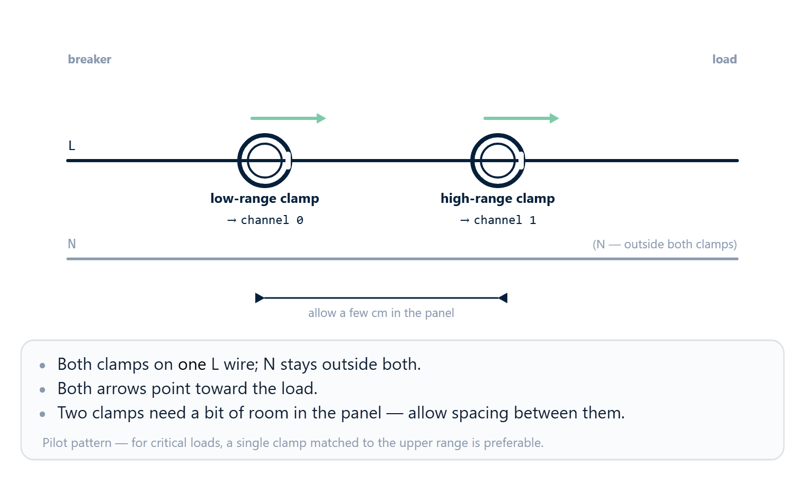

# 03 · Current sensor selection


This chapter answers two questions:

1. Which current sensor to choose for a given load.
2. How to tell the rbAmp module about your choice so that the factory
   calibration for that combination loads automatically.

The physical wiring of the sensor (clamp orientation, L/N polarity
check) is covered in [04_hardware.md](04_hardware.md). This chapter is
about **choosing the model** and the **API calls**.

## Sensor class

rbAmp modules work with CT clamps from the **SCT-013** family. The
sensor class is determined by the module's hardware revision and is set
at the factory — the user reports their choice via `dev.set_sensor_class()`
before selecting a specific CT clamp model.

## Choosing an SCT-013 model

Within the SCT-013 family, five models are characterized on the current
bench (codes `{1, 2, 3, 4, 6}`); codes `5` and `7` exist in the API and
SPEC but are not yet validated and are **rejected** by the library
client-side (pre-bus, with no I²C transaction).

| `code` | Model | Current range | Status | Typical use |
|:---:|---|---|:---:|---|
| **1** | SCT-013-005 | 0…5 A | ✅ characterized | Small loads — lamps, low-power electronics, a single switch |
| **2** | SCT-013-010 | 0…10 A | ✅ characterized | One medium-power appliance — fridge, washing machine, air conditioner up to 2 kW |
| **3** | SCT-013-030 | 0…30 A | ✅ characterized | Mid-size household service entry — up to ~7 kW |
| **4** | SCT-013-050 | 0…50 A | ✅ characterized | Large service entry — electric heating, EV charger, single-family home with peak loads |
| **5** | SCT-013-100 | 0…100 A | ⏳ uncharacterized | (Main service entry; code reserved, requires bench validation.) |
| **6** | SCT-013-020 | 0…20 A | ✅ characterized | Medium service entry — 3–4 kW appliances, heavy household equipment |
| **7** | SCT-013-060 | 0…60 A | ⏳ uncharacterized | (Industrial sub-meter; code reserved, requires bench validation.) |

> **Production-safe codes — `{1, 2, 3, 4, 6}`**. Calling
> `dev.set_ct_model_ch(ch, 5)` or `dev.set_ct_model_ch(ch, 7)`
> (or passing such a code to `dev.configure_channels(...)`)
> raises **`RbAmpParamError`** — the library **does not send** the write
> to the device (client-side guard `_validate_ct_code`,
> `REG_ERROR` on the device stays `0x00`).
>
> Per-class accepted sets (v1.3 firmware):
> - `RbAmpSensorClass.SCT_013` → `{1, 2, 3, 4, 6}`
> - `RbAmpSensorClass.WIRED_CT` → `{1, 2, 3}` (factory preset slots)
> - `RbAmpSensorClass.BUILTIN_CT` → `∅` (onboard CT, no codes)
>
> Codes `0x06` and `0x07` are non-monotonic by rating (added after the
> original `0x01..0x05`). Pick by the rating you need.

### How to pick the right model

The basic rule:

1. **Determine the maximum current** that can flow in the circuit
   (based on the largest load + 30% headroom).
2. Choose the model whose range covers that value.
3. **Do not over-size by more than 5×**. An SCT-013-100 clamp on a
   circuit with a maximum current of 5 A will work, but it gives low
   resolution and large error at typical values.

### Headroom

An SCT-013 clamp operates without saturation within its rated range.
Short-lived peaks (compressor inrush, inductive load) can exceed the
rating by 5–7× — this is **normal**, the clamp physically withstands it,
but measurement becomes non-linear above the rating.

If your load has a peak current above the clamp's rating, go one size
up. For example, for a washing machine with a 12 A inrush current (and a
2–3 A rating during operation) SCT-013-030 is better than SCT-013-005.

## How to tell the module about your choice

**Two calls in the correct order are mandatory** — first
`dev.set_sensor_class()`, then `dev.set_ct_model()`. If you call
`dev.set_ct_model()` before `dev.set_sensor_class()`, the package raises
`RbAmpModeError`:

```text
REG_SENSOR_CLASS is UNSET;
call dev.set_sensor_class(RbAmpSensorClass.SCT_013) first
```

> **CT model — a functional preset, not a label.** Writing the CT model
> immediately applies the NF baseline, gain, and shape factor — the
> current readings change. Changing sensor_class resets CT_MODEL to its
> default and requires setting it again.

```python
from rbamp import RbAmp, RbAmpSensorClass, RbAmpModeError

with RbAmp(bus, 0x50) as dev:
    # Step 1: sensor class. MANDATORY before set_ct_model().
    try:
        dev.set_sensor_class(RbAmpSensorClass.SCT_013)
    except RbAmpModeError as e:
        # Possible causes: communication failure (see 10 · Troubleshooting),
        # invalid argument (cls outside the known values)
        print("set_sensor_class failed:", e)
        return

    # Step 2: model within the family.
    # 1 = SCT-013-005, 2 = SCT-013-010, 3 = SCT-013-030,
    # 4 = SCT-013-050, 6 = SCT-013-020 (code 5 reserved).
    try:
        dev.set_ct_model(3)   # e.g. SCT-013-030
    except RbAmpModeError:
        print("Sensor class must be set first")
    except ValueError:
        print("Code not in per-class accept-set (SCT_013: {1,2,3,4,6})")
```

`set_sensor_class()` accepts **either an enum or a plain int** —
both forms are equivalent:

```python
dev.set_sensor_class(RbAmpSensorClass.SCT_013)  # explicit enum form
dev.set_sensor_class(1)                          # numeric (equivalent)
```

> **The package deliberately does NOT call `set_sensor_class()` on your
> behalf**. If this step is skipped, `set_ct_model()` raises
> `RbAmpModeError` without writing to flash. This is by design, so that
> the behavior is predictable and explicit — no "magic" in the public
> API.

After these two calls:

- The module saves both values to flash — the setting survives a
  reset, a power-cycle, and a firmware re-flash.
- The calibration coefficients for that specific combination (sensor
  class + model) are loaded from the factory preset table. You do not
  need to touch any manual calibration registers.
- The next read of `dev.current[0]` (or `dev.read_current(0)`)
  already returns a value in amperes with the correct scaling.

**Total time for both calls** is about **1.4 seconds** (two flash-write
operations × ~700 ms each, limited by the flash page erase time). It is
done **once** at first installation; the setting is saved to flash and
is not repeated again.

> If you already chose the sensor on first run and you are simply
> restarting the script, you do not need to repeat the
> `set_sensor_class()` and `set_ct_model()` calls — the module remembers
> the previous choice. But there is no harm either — calling again with
> the same value just rewrites the same byte.

### Verifying the setup

A simple sanity check after `set_ct_model()`:

```python
import time
from rbamp import RbAmp, RbAmpSensorClass

def sanity_check(dev):
    print("Ready. Connect a purely resistive load",
          "(e.g. an incandescent lamp).")
    print("Expect a stable PF ~= 1.0 and a positive P.")

    while True:
        u  = dev.voltage              # property — one I²C transaction
        i  = dev.read_current(0)
        p  = dev.read_power(0)
        pf = dev.read_power_factor(0)
        print(f"U={u:.1f} V  I={i:.2f} A  P={p:.1f} W  PF={pf:.2f}")
        time.sleep(2)

with RbAmp(bus, 0x50) as dev:
    dev.set_sensor_class(RbAmpSensorClass.SCT_013)
    dev.set_ct_model(3)
    sanity_check(dev)
```

On MicroPython, replace `time.sleep(2)` with `time.sleep_ms(2000)`.

On a purely resistive load (incandescent lamp, electric kettle, heating
element) you should expect:

- `U` ≈ 220–240 V (for 230 V mains)
- `I` ≈ matches the load power (P / U)
- `P` > 0 and stable
- `PF` ≈ 1.0 (definitely positive)

If something does not add up, see [10_troubleshooting.md](10_troubleshooting.md).

## Modules with multiple current channels

### SKU lineup — what fits the task

| SKU | I channels | U channel | Typical use |
|---|---|---|---|
| **UI1** | 1 | yes | One load with full power computation (P, PF) |
| **UI2** | 2 | yes | Two independent loads on the **same** phase (service entry + a large consumer) |
| UI3 | 3 | yes | **Roadmap** — not shipping on the current MCU package (needs 4 ADC channels; described for forward-compat). |
| **I1** | 1 | no | Sub-meter without power computation (current only) |
| **I2** | 2 | no | Two sub-meters, or a dual-CT topology on a single line |
| **I3** | 3 | no | Three sub-meters, or dual-CT + a third current channel |

### What each channel measures

- **U channel** (UI* only): U_rms, U_peak, frequency. **One** per module.
- **I channels** (all SKUs): each channel independently — I_rms, I_peak, P (active power), PF, avg_p per period.
- **I variants**: I1/I2/I3 have no U channel — P/PF computation is not possible on the device (only I_rms per channel).
- **Single-phase module**: the current UI2/I2/I3 are single-phase. All I channels must be on the same phase (or, for I variants, on the same phase as well if you want to compute P correctly master-side).

### Per-channel CT model — independent calibration

On the `UI2`, `I2`, and `I3` modules each current channel has an
**independent** SCT-013 model selection. You can connect, for example,
an SCT-013-005 on channel 0 (a single outlet), an SCT-013-030 on channel
1 (a stove line), and an SCT-013-020 on channel 2 (a medium feed
— I3 only).

The API for per-channel selection is `dev.set_ct_model_ch(channel, code)`:

```python
dev.set_sensor_class(RbAmpSensorClass.SCT_013)   # once for all channels

# v1.3: binding order does NOT matter (Fix A pure-staging).
dev.set_ct_model_ch(0, 1)   # channel 0: SCT-013-005
dev.set_ct_model_ch(1, 3)   # channel 1: SCT-013-030
dev.set_ct_model_ch(2, 6)   # channel 2: SCT-013-020 (I3 only)
```

> ✅ **v1.3: channel binding order does not matter** (Fix A pure-staging). On v1.3 writing `REG_CT_MODEL (0x05)` stages the value but **no longer applies** it automatically to ch0. Application happens **only** via `CMD_SET_CT_MODEL_CHn`. This means you can configure channels in **any order** — with no clobber.

The single-argument `dev.set_ct_model(code)` is a convenience form for
single-channel SKUs (applied to channel 0). On multi-channel modules it
is equivalent to `dev.set_ct_model_ch(0, code)`.

## Advanced setup: two clamps of different ratings on one wire

> ⚙ **An additional pattern, not the basic one.** This section describes
> an optional technique for improving resolution at low currents. For
> most installations a single clamp matched to the load range is
> sufficient. Use dual-CT only if you have a specific accuracy
> requirement at currents < 1 A.

### When it applies

- Multi-channel modules **UI2 / I2 / I3** (at least 2 I channels).
- The same wire needs to be measured both for small loads (≤ 1 A)
  and for peak events (≥ 5 A) with equal quality.
- A typical example: an apartment service entry where during the day
  there is 50–100 W of standby, and in the evening — a kettle or a stove
  inrush at 3+ kW.

### The idea

**Two** SCT-013 clamps of different ratings are installed on the same
wire:

- Channel 0 — the small clamp (e.g. SCT-013-005, 5 A): sees small
  currents with better resolution and a lower noise floor.
- Channel 1 — the large clamp (e.g. SCT-013-030 or higher): handles
  currents above the small clamp's overload point without saturation.

The master itself chooses which channel to use depending on the current
value — while the small clamp is in its linear range, its reading is
more accurate; once it is exceeded, it switches to the large one.

### Configuration (order-independent on v1.3)

First the sensor class **once**, then the models per channel **in any
order**. On v1.3 firmware (Fix-A pure-staging), writing
`REG_CT_MODEL (0x05)` only **stages** the value; binding to a specific
channel happens exclusively via the per-channel `CMD_SET_CT_MODEL_CHn`
opcode. The legacy "descending order" workaround required on v1.2
firmware is **no longer needed**.

```python
dev.set_sensor_class(RbAmpSensorClass.SCT_013)   # once

# Any order is valid on v1.3 — each call binds its own channel.
dev.set_ct_model_ch(0, 1)   # ch0 = SCT-013-005 (0..5 A)
dev.set_ct_model_ch(1, 3)   # ch1 = SCT-013-030 (0..30 A)
```

Final state: `ch0 = SCT-013-005`, `ch1 = SCT-013-030`. ✓

### Aggregation logic on the master side

The simplest pattern is to switch on a threshold:

```python
import math

def read_combined_current(dev):
    """Read the combined current — picks low-CT when in its linear range,
    otherwise falls back to the high-CT.
    """
    i_low  = dev.read_current(0)   # the small clamp
    i_high = dev.read_current(1)   # the large clamp

    # While the small clamp is far from saturation, it gives better
    # accuracy at low currents. Switch to the large one when
    # approaching the overload point.
    #
    # The 4.5 A threshold for SCT-013-005 is PROVISIONAL; the exact
    # value will be determined by bench validation (see below).
    # Behavior in the vicinity of the threshold is a matter of
    # measurement, not estimation.
    if not math.isnan(i_low) and i_low < 4.5:
        return i_low
    return i_high
```



<!-- MD028 separator -->

> ⚙ **Bench validation.** The exact figures of the dual-CT pattern
> (behavior in the vicinity of the threshold, temperature drift, the
> divergence of the two clamps in the overlapping range) are established
> by the factory bench-validation program . Until it is
> complete, treat dual-CT as a pilot pattern; for critical applications a
> single clamp matched to the upper end of the load range is preferable.

### Approaches to improving sensitivity at low currents

If your load has a large dynamic range (for example, 1 W of standby for
a router vs a 2000 W water heater on the same outlet), a single clamp
sized for the upper limit loses the lower currents in the noise.

Three strategies in increasing order of complexity:

1. **Size the CT for the maximum, not "with headroom"**. The most
   common mistake is to put an SCT-013-100 (100 A) on a home outlet with
   a typical consumption of 0.5–10 A. The signal sits in the lower 1–10%
   of the ADC — where noise becomes comparable to the signal. For a
   household scenario (16 A outlet) SCT-013-030 is optimal; for
   connecting a single device (≤ 5 A) — SCT-013-005.
2. **Dual-CT topology** (requires a UI2/UI3 SKU): a small clamp on the
   lower range + a large one on the upper, with the master choosing by
   threshold. See the "Dual-CT topology" section above — the pattern is a
   pilot one, the numbers are being refined by the factory bench-validation program.
3. **Bench calibration of the noise floor** (factory-side): the factory bench-calibration program
   characterizes the noise floor on the test bench; the results are baked
   into the firmware's calibration array. On the user side, there is
   nothing to do beyond `set_sensor_class()` + `set_ct_model()`. Until the
   program is complete, the specific low-current accuracy figures are not
   published.

## Production vs Develop mode (persistence reference)

The rbAmp module operates in two modes, differing in **what exactly is saved to flash**.

| Command (opcode) | Production | Persists |
|---|---|---|
| `CMD_SAVE_USER_CONFIG` (0x32) | ✅ **OK** | `ct_model` / `sensor_class` / per-channel CT / `fleet_config` / `group_id` / `label` |
| `CMD_COMMIT_ADDR` (0x30, magic-armed) | ✅ **OK** | I²C address (two-phase address commit, see [04 · Wiring](04_hardware.md)) |
| `CMD_RESET` (0x01) | ✅ OK | — (software reset) |
| `CMD_LATCH_PERIOD` (0x27) | ✅ OK | — (period snapshot) |
| `CMD_CLEAR_ERROR` | ✅ OK | — |
| `CMD_SAVE_GAINS` (0x26) | ❌ **BLOCKED** in production (returns `DEV_ERR_PARAM`; reboot reverts) — factory-only | gains / NF / phase (factory cal) |
| `CMD_FACTORY_RESET` | ❌ **BLOCKED** in production | — |

In production mode, writes of factory calibration are **rejected by the firmware** — protection against accidentally erasing the factory coefficients.

> **Read-back ≠ persistence** (v1.3 A7 HW-verified). The production guard accepts the write into RAM (a subsequent read returns what was written), but the flash-save may be rejected. **The only valid way to confirm persistence is to reboot the module via `CMD_RESET` and read again**:
>
> ```python
> dev.set_ct_model(code)
> dev.reset()                     # CMD_RESET 0x01, works in production
> time.sleep(0.3)                 # boot complete (300 ms canonical)
> check = dev.read_reg(0x05)
> assert check == code            # ONLY now is persistence confirmed
> ```
>
> **The address is an exception** (v1.3 A2 Fix 4): `REG_I2C_ADDRESS` reads the **active** address at boot. After staging it echoes the candidate until `CMD_COMMIT_ADDR` + reset.

Cross-link: [09 · API reference](09_api_reference.md) — details on specific opcodes, [10 · Troubleshooting](10_troubleshooting.md) — what to do if persistence is not confirmed.

## What's next

- [04 · Wiring](04_hardware.md) — physical connection of the
  clamp, arrow orientation, L/N polarity
- [05 · Quickstart](05_quickstart.md) — the full first-light script
  for both backends
- [06 · Examples](06_examples.md) — working scenarios for different
  consumers
- [10 · Troubleshooting](10_troubleshooting.md) — what to do if the
  readings look strange (negative PF, unstable I, etc.)

