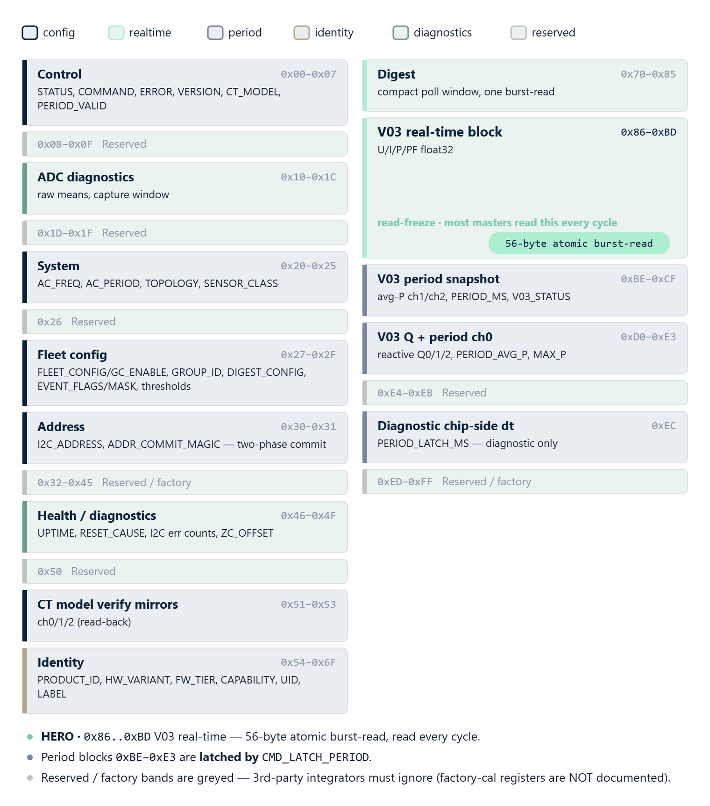

# 09 · API Reference




The complete public API of the `rbamp` package. Source —
[`__init__.py`](https://github.com/rb-amp/rbamp-python) (re-exports),
[`_rbamp_core.py`](https://github.com/rb-amp/rbamp-python) (the main `RbAmp` class),
[`_snapshot.py`](https://github.com/rb-amp/rbamp-python) (POD structures + exception
hierarchy), [`_energy.py`](https://github.com/rb-amp/rbamp-python) (Wh accumulator),
[`_registers.py`](https://github.com/rb-amp/rbamp-python) (auto-generated constants).

This chapter is a reference: signatures, return values, side
effects, edge cases. For working examples go to
[06 · Examples](06_examples.md); for a quick start, see
[05 · Quickstart](05_quickstart.md).

## Imports

```python
from rbamp import (
    RbAmp,                     # main class
    RbAmpEnergy,               # Wh accumulator (accessed via dev.energy)
    RbAmpSnapshot,             # RT-block dataclass-style
    RbAmpPeriodSnapshot,       # period snapshot dataclass-style
    RbAmpSensorClass,          # sensor-class enum
    TOPOLOGY_SINGLE, TOPOLOGY_SPLIT_PHASE, TOPOLOGY_THREE_PHASE,
    topology_name,             # helper: int → topology name
    # Exception hierarchy
    RbAmpError,                # base class of all errors
    RbAmpIOError,
    RbAmpTimeoutError,
    RbAmpNotReadyError,
    RbAmpStaleError,
    RbAmpParamError,
    RbAmpModeError,
    RbAmpVersionError,
    # Metadata
    __version__,               # "1.3.0"
    __protocol_version__,      # 0x04 (RBAMP_PROTOCOL_VERSION)
    REGISTERS, COMMANDS,       # raw protocol constants (advanced use)
)
```

Minimal import for a typical application:

```python
from rbamp import RbAmp, RbAmpSensorClass, RbAmpError
```

## General idioms

The API follows standard Python patterns:

- **Class-based**: the main `RbAmp` class owns everything — RT
  readings, period, configuration, diagnostics. The handle holds the
  backend + energy accumulator internally.
- **Context manager**: `with RbAmp(bus, addr) as dev:` — the
  recommended idiom. `__enter__` automatically calls
  `dev.begin()`.
- **Properties for RT readings**: `dev.voltage`, `dev.frequency` —
  one property = one I²C transaction. Channel-indexed ones go through
  `_ChannelProxy`: `dev.current[ch]`, `dev.power[ch]`,
  `dev.power_factor[ch]`.
- **Methods for channel-indexed reads**: `dev.read_current(ch)`,
  `dev.read_power(ch)`. Fully equivalent to the property form —
  use whichever is convenient.
- **Exceptions for errors**: every error is a subclass of `RbAmpError`.
  The standard Python `try / except` pattern (not `last_error()` +
  a return code).
- **Async generator** for periodic streaming: `async for snap in
  dev.stream_period(interval_s=...)`.

## Types

### `RbAmp`

```python
class RbAmp:
    def __init__(self, bus, addr: int = 0x50): ...
```

The main class. One instance per slave device. The bus is any
object with one of the "known" API signatures: `smbus2.SMBus`,
`machine.I2C`, or a custom backend (see [04 · Hardware](04_hardware.md)).

The backend is selected **automatically** on the first bus access:

| bus-object method | Backend |
|---|---|
| `bus.readfrom_mem`, `bus.writeto_mem` | `MachineI2CBackend` (MicroPython) |
| `bus.read_byte_data`, `bus.write_byte_data` | `SMBusBackend` (CPython + smbus2) |
| `bus.read_byte`, `bus.register_acks`, `bus.now_ms` | already-wrapped (test mocks, FTDI adapters) |

If no signature matches, an `RbAmpParamError` is raised with a
description.

### Exception hierarchy

Every error from the package is a subclass of `RbAmpError`, which
itself inherits from **`OSError`** (not bare `Exception`). This
means: existing code with `except OSError:` handlers **keeps
catching** rbAmp errors without any rewrite — the standard Python
convention for hardware-I/O drivers.

```text
OSError
└── RbAmpError                  (base, inherits OSError for compatibility)
    ├── RbAmpIOError            — I²C transport error (NACK, retry exhausted, sanity reject)
    ├── RbAmpTimeoutError       — timeout (wait_ready / commit_address_change window)
    ├── RbAmpNotReadyError      — device not ready (reserved)
    ├── RbAmpStaleError         — period snapshot stale (valid flag = 0)
    ├── RbAmpParamError         — invalid argument (channel out of range, code not in per-class accept-set)
    ├── RbAmpModeError          — operation requires develop mode (factory_reset / save_gains)
    └── RbAmpVersionError       — incompatible firmware version
```

> **Note**: `RbAmpParamError` inherits from `RbAmpError` + `ValueError`
> on CPython (multi-base). On MicroPython, where multi-base
> inheritance is not supported by all ports, it falls back to
> single-base. From the user's point of view,
> `try / except RbAmpParamError` works the same way. **But
> `try / except ValueError` catches **only on CPython** — on
> MicroPython this handler is missed.**
> Code that relies on cross-platform behavior must catch
> `RbAmpParamError` explicitly.

Standard usage:

```python
try:
    snap = dev.read_period_snapshot()
except RbAmpStaleError:
    # period not ready yet — the master timestamp was committed by the package
    continue
except RbAmpIOError as e:
    log.warning("bus failure: %s", e)
except RbAmpError as e:
    log.error("unexpected: %s", e)
```

### `RbAmpSensorClass`

```python
class RbAmpSensorClass(IntEnum):
    UNSET       = 0   # factory value after reset
    SCT_013     = 1   # SCT-013 series (shipping default)
    WIRED_CT    = 2   # Reserved — STANDARD tier
    BUILTIN_CT  = 3   # Reserved — PRO tier
```

> **Note**: on CPython, `IntEnum` from the stdlib `enum` is used. On
> MicroPython ports without an `enum` module, a plain-class fallback
> with the same member values is used. From the user's point of view
> the two forms are identical:
> `dev.set_sensor_class(RbAmpSensorClass.SCT_013)` or
> `dev.set_sensor_class(1)` — both work.

Only `UNSET` and `SCT_013` are meaningful for the current firmware.
The reserved values are present in the API for compatibility with
future SKUs — for now, passing them to `set_sensor_class()` will
raise `RbAmpParamError`.

### `RbAmpSnapshot`

Returned by `dev.read_all()`. A plain Python class (not a
`@dataclass`, for MicroPython compatibility). All fields in SI units.

```python
class RbAmpSnapshot:
    voltage:        float       # V — RMS voltage
    voltage_peak:   float       # V — peak voltage
    current:        list        # [ch0, ch1, ch2] — RMS current per channel, A
    current_peak:   list        # [ch0, ch1, ch2] — peak current, A
    power:          list        # [ch0, ch1, ch2] — active power (signed), W
    power_factor:   list        # [ch0, ch1, ch2] — dimensionless, −1..+1
    frequency:      float       # Hz
    topology:       int         # TOPOLOGY_* constant
    channels:       int         # 1..3 — number of valid channels
    has_voltage_hw: bool        # True if a voltage sensor is present
```

Unused channels (beyond `channels`) are filled with zeros.

### `RbAmpPeriodSnapshot`

Returned by `dev.read_period_snapshot()`. The energy-accounting
primitive.

```python
class RbAmpPeriodSnapshot:
    avg_p:        list   # [ch0, ch1, ch2] — average P over the period, W
    max_p:        float  # peak instantaneous power on channel 0
    latch_ms:     int    # period duration (device's view)
    master_dt_ms: int    # master wall-clock dt since the last latch
    valid:        bool   # True if the latch-ready flag was set
```

> For energy integration, use `master_dt_ms`, not `latch_ms` — the
> module's internal timer has limited accuracy.

### Topology constants

```python
TOPOLOGY_SINGLE      = 1   # 1 current channel (UI1 / I1)
TOPOLOGY_SPLIT_PHASE = 2   # 2 current channels (UI2 / I2)
TOPOLOGY_THREE_PHASE = 3   # 3 current channels (UI3 / I3)

topology_name(topology: int) -> str   # 1 → "SINGLE", 2 → "SPLIT_PHASE", ...
```

## Lifecycle

### `RbAmp(bus, addr=0x50)`

Constructor. Backend resolution happens in `__init__`. No I²C
traffic is generated until `begin()`.

| Parameter | Description |
|---|---|
| `bus` | I²C bus object (smbus2.SMBus, machine.I2C, or a wrapper) |
| `addr` | 7-bit slave address. Range 0x08..0x77, default 0x50 |

**Raises**: `RbAmpParamError` if the bus object is not recognized or
`addr` is out of range.

### `dev.begin()`

Probes the device + caches topology + primes the LATCH.

Sequence:

1. Reads `REG_VERSION` — raises `RbAmpIOError` on NACK,
   `RbAmpVersionError` if `0x00` / `0xFF` is returned.
2. Caches topology (on the current firmware, `begin()` does no
   auto-probe; it uses the hint from the constructor).
3. Reads `U_rms` to determine whether a voltage sensor is present
   (threshold 1.0 V).
4. Writes `CMD_LATCH_PERIOD` (primer) + waits 50 ms.
   The first snapshot after power-up is discarded.
5. Stores `time.monotonic()` (or `time.ticks_ms()` on uPy) for
   subsequent energy integration.

Idempotent: safe to call repeatedly.

### Context manager

```python
with RbAmp(bus, 0x50) as dev:
    # dev.begin() has already been called in __enter__
    ...
# __exit__ — no-op (bus closing is the caller's responsibility)
```

The recommended idiom. The package's `__exit__` does NOT close the
bus — managing the bus object remains the caller's job (the typical
pattern is nested `with SMBus(1) as bus, RbAmp(bus, 0x50) as dev:`).

### `dev.probe() -> bool`

A lightweight liveness check. A single `REG_VERSION` read with no
side effects.

**Returns**: `True` if the slave ACKed and reported a supported
version; `False` otherwise. **Does not raise** — for polling
scenarios.

### `dev.wait_ready(timeout_ms=1000) -> None`

Polls the module's ready flag until bit 0 is set. Useful after
power-up — the module may need up to 200 ms for its first RT window.

**Raises**: `RbAmpTimeoutError` if the bit is not seen before
`timeout_ms` elapses.

### Properties — handle state

```python
dev.firmware_version: int      # REG_VERSION — opaque byte
dev.topology:         int      # TOPOLOGY_* constant
dev.topology_name:    str      # "SINGLE" / "SPLIT_PHASE" / "THREE_PHASE"
dev.channels:         int      # 1..3
dev.has_voltage_hw:   bool     # True if begin() detected U_rms > 1.0
dev.address:          int      # 7-bit I²C address (updated after commit_address_change)
```

**`firmware_version` is a live property: every read hits the
bus** (one single-byte read of `REG_VERSION`). Cache it on the
application side if you poll it in a hot loop:
`fw = dev.firmware_version` once after `begin()`. If `begin()`
has not been called yet, `firmware_version` raises `RbAmpIOError`
(the module may NACK while the handle is "cold").

The remaining properties (`topology`, `channels`, `has_voltage_hw`,
`address`) are cached in the handle and return the values stored
after `begin()` without hitting the bus.

## Real-time readings (RT block, 200 ms update)

All methods raise `RbAmpIOError` on a communication failure (NACK
after retry or sanity reject) or `RbAmpParamError` on an invalid
argument.

### Properties

```python
dev.voltage         -> float   # V — RMS voltage
dev.voltage_peak    -> float   # V — peak voltage
dev.frequency       -> float   # Hz — mains frequency
```

Channel-indexed through `_ChannelProxy` — supports `[ch]`
indexing and iteration:

```python
dev.current         # _ChannelProxy → dev.current[0], dev.current[1], ...
dev.current_peak    # _ChannelProxy
dev.power           # _ChannelProxy
dev.power_factor    # _ChannelProxy
```

Usage:

```python
i0 = dev.current[0]                       # a single channel
for i in dev.current:                      # iterate over all valid channels
    print(i)
total = sum(p for p in dev.power)          # sum of all channels
```

`len(dev.current)` equals `dev.channels` (1..3).

### Methods (fully equivalent to the property form)

```python
dev.read_voltage(phase=0)         -> float
dev.read_voltage_peak(phase=0)    -> float
dev.read_current(ch=0)            -> float
dev.read_current_peak(ch=0)       -> float
dev.read_power(ch=0)              -> float       # signed
dev.read_power_factor(ch=0)       -> float
dev.read_frequency()              -> float
```

### One-shot read of the entire RT block

```python
dev.read_all()  -> RbAmpSnapshot
```

Equivalent to consecutive `read_voltage` + `read_voltage_peak` +
`read_current(0..N)` + `read_current_peak(0..N)` + `read_power(0..N)` +
`read_power_factor(0..N)` + `read_frequency`. Unused channels
(beyond `channels`) are filled with zeros.

**Raises**: `RbAmpIOError` if any sub-read fails.

## Period accounting

See [01 · Overview](01_overview.md) for the big picture and
[05 · Quickstart](05_quickstart.md) Step 5 for a minimal template.

### `dev.latch_period() -> None`

Writes `CMD_LATCH_PERIOD`. Does not wait — the caller must allow the
50 ms settle and check `dev.is_period_valid()` before reading.

For most tasks, use `read_period_snapshot()` — it encapsulates the
whole sequence.

### `dev.is_period_valid() -> bool`

Reads the latch-ready bit. Returns `True` if the last snapshot is
fresh.

### `dev.read_period_avg_power(ch=0) -> float`

Average active power on a channel over the latched period. Must be
called after `latch_period()` + a 50 ms settle + a valid check.

### `dev.read_period_max_power() -> float`

Peak instantaneous power on channel 0 over the latched period.
`ch=0` only on v1 firmware.

### `dev.read_period_latch_ms() -> int`

Period duration from the **device's** perspective, in ms.

> **Diagnostic value.** The module's internal timer has limited
> accuracy. For energy integration, use `master_dt_ms` from
> `RbAmpPeriodSnapshot`, not this field.

### `dev.read_period_snapshot(settle_ms=50, skip_latch=False) -> RbAmpPeriodSnapshot`

**The recommended entry point** for period accounting. The full
sequence under the hood:

1. If `skip_latch=True` — skip the LATCH write (for the
   multi-module pattern after a manual series of LATCH commands).
2. Otherwise — write `CMD_LATCH_PERIOD`.
3. Capture `time.monotonic()` to compute `master_dt_ms`.
4. `time.sleep(settle_ms / 1000)` — 50 ms by default.
5. Check the latch-ready flag. If 0 — raise
   `RbAmpStaleError` (committing the timestamp first so the next
   snapshot does not double-count the `dt`).
6. Read `avg_p[0..channels-1]` + `max_p` + `latch_ms`.
7. Update the timestamp + call `energy.tick(snap)` to integrate
   Wh (unless the accumulator is disabled via `energy.disable()`).

| Parameter | Description |
|---|---|
| `settle_ms` | Wait after LATCH, in ms. Default 50. |
| `skip_latch` | If `True` — do not write LATCH, only read. |

**Raises**: `RbAmpStaleError` (snapshot stale); `RbAmpIOError`
(bus failure).

### `async dev.stream_period(interval_s=60.0, skip_stale=True)`

An async generator that yields `RbAmpPeriodSnapshot` at the
`interval_s` interval. Works on CPython `asyncio` and MicroPython
`uasyncio` (MicroPython ≥ 1.20 — `import asyncio` also works; for
earlier versions use `import uasyncio as asyncio`).

```python
async for snap in dev.stream_period(interval_s=60.0):
    # snap is an RbAmpPeriodSnapshot, .valid guaranteed True (by default skip_stale=True)
    print(snap.avg_p[0])
```

| Parameter | Description |
|---|---|
| `interval_s` | Period between latches (≥ 30 s recommended) |
| `skip_stale` | `True` (default) — stale snapshots are skipped automatically. `False` — they are yielded with `snap.valid=False`, and your code must check `if not snap.valid: continue` itself |

> ⚠ **CPython: blocks the event loop.** Under the hood,
> `stream_period()` calls the synchronous, **blocking**
> `read_period_snapshot()` — which does a `time.sleep(0.05)` settle
> plus ~50–100 ms of single-byte reads over the bus. On CPython this
> blocks the entire `asyncio` event loop for those 100 ms — other
> coroutines (MQTT, HTTP, Wi-Fi keepalive) get no CPU. For
> production servers, wrap it in `run_in_executor`:
>
> ```python
> import asyncio
>
> async def stream_period_nonblocking(dev, interval_s=60.0):
>     loop = asyncio.get_event_loop()
>     while True:
>         await asyncio.sleep(interval_s)
>         snap = await loop.run_in_executor(None, dev.read_period_snapshot)
>         if snap.valid:
>             yield snap
> ```
>
> On **MicroPython** the problem is smaller — the uasyncio scheduler
> yields to other tasks less often, and blocking I²C is considered
> acceptable in embedded async patterns. If you need
> non-blocking behavior, use a separate thread via
> `_thread.start_new_thread` (on ESP32 µPy).

## Energy accounting (master-side accumulator)

### `dev.energy` — `RbAmpEnergy` instance

A per-channel Wh accumulator. Accessed through a property — the
package owns the instance:

```python
dev.energy.wh(ch=0)         -> float    # current Wh total for the channel
dev.energy.reset(ch=0)      -> None     # zero a single channel
dev.energy.reset_all()      -> None     # zero all channels
dev.energy.disable()        -> None     # turn off auto-integration
dev.energy.enable()         -> None     # turn it back on
```

The accumulator is updated automatically on every successful
`dev.read_period_snapshot()`. It is signed — a negative value means
net export.

Integration formula:

```text
wh[ch] += snap.avg_p[ch] × master_dt_ms / 1000 / 3600
         [W]             [milliseconds]              → [Wh]
```

`dev.energy.disable()` is useful for deep-sleep scenarios where the
master itself owns the Wh persistence in RTC memory — see
[06 · Examples](06_examples.md), Scenario 9.

## Sensor configuration

A two-step sequence. For a detailed model-selection guide, see
[03 · Current sensor selection](03_sensor_selection.md).

### `dev.set_sensor_class(cls) -> None`

Sets the current-sensor class and saves it to flash. Blocking,
~705 ms.

```python
dev.set_sensor_class(RbAmpSensorClass.SCT_013)
# or equivalently:
dev.set_sensor_class(1)
```

| Parameter | Description |
|---|---|
| `cls` | An `RbAmpSensorClass` enum or an int 0..3 |

**Raises**:

- `RbAmpParamError` — `cls` not in {`UNSET`, `SCT_013`} (the
  reserved values are unsupported on the current SKU)
- `RbAmpIOError` — communication failure

Must be called **before** `set_ct_model*()`.

### `dev.set_ct_model(code) -> None`

The single-parameter (legacy) form — sets the CT-clamp model **on
channel 0 only**.

| `code` | Model |
|:---:|---|
| 1 | SCT-013-005 |
| 2 | SCT-013-010 |
| 3 | SCT-013-030 |
| 4 | SCT-013-050 |
| 6 | SCT-013-020 |

> Code `5` is reserved in v1.3 firmware (formerly `SCT-013-100`) and returns `DEV_ERR_PARAM`. Code `7` (60 A) is still uncharacterized. The accepted set for the `SCT_013` class is `{1, 2, 3, 4, 6}` (non-contiguous). The full per-class accept-set table is in [03 · Current sensor selection](03_sensor_selection.md#per-class-ct-validation).

**Raises**:

- `ValueError` (and also `RbAmpParamError`) — `code` not in the per-class accept-set for the current `REG_SENSOR_CLASS` (for `SCT_013` this is `{1, 2, 3, 4, 6}`)
- `RbAmpModeError` — if `set_sensor_class()` was not called
- `RbAmpIOError` — communication failure

`RbAmpModeError` message:

```text
REG_SENSOR_CLASS is UNSET;
call dev.set_sensor_class(RbAmpSensorClass.SCT_013) first
```

Equivalent to `dev.set_ct_model_ch(0, code)`.

### `dev.set_ct_model_ch(channel, code) -> None`

The per-channel form. Sets the CT-clamp model on a specific channel.

Under the hood: stage `REG_CT_MODEL (0x05)` → command
`CMD_SET_CT_MODEL_CH0/1/2` (opcode 0x28/0x29/0x2A) → 5 ms settle →
`CMD_SAVE_USER_CONFIG (0x32)` → 700 ms. Blocking, ~705 ms.

> ✅ **v1.3: channel-binding order does not matter** (Fix A pure-staging). On v1.3, writing `REG_CT_MODEL (0x05)` stages the value but **no longer applies** it automatically to ch0. Application happens **only** through `CMD_SET_CT_MODEL_CHn`. You can configure channels in any order.
>
> ```python
> dev.set_ct_model_ch(0, 1)  # any order is OK on v1.3
> dev.set_ct_model_ch(1, 3)
> dev.set_ct_model_ch(2, 6)
> ```

**Raises**:

- `RbAmpParamError` — `channel` out of 0..`dev.channels-1` or `code` not in the per-class accept-set (for `SCT_013` — `{1, 2, 3, 4, 6}`; code 5 reserved)
- `RbAmpModeError` — `set_sensor_class()` not called

### V2 verify mirrors — `CT_MODEL_CH0/1/2 (0x51-0x53)`

Read-only registers reflecting the CT preset actually applied on each channel. The write wire-protocol **does not change** — writes use the mechanism above. 0x51-0x53 are merely a read-back for state checks and read-compare-write patterns:

```python
applied_ch0 = dev.read_reg(0x51)   # what is actually applied
applied_ch1 = dev.read_reg(0x52)
applied_ch2 = dev.read_reg(0x53)
```

### `dev.save_gains() -> None`

A "bare" `CMD_SAVE_GAINS (0x26)` write — **factory-only**.

> ⛔ **BLOCKED in production firmware** (v1.3 returns
> `DEV_ERR_PARAM`; the device rejects the write and a subsequent
> reboot reverts any RAM-side change). `CMD_SAVE_GAINS` is reserved
> for the factory-provisioning mode and persists gains / NF / phase
> coefficients only. For user-facing persistence of
> `sensor_class` / `ct_model` per channel / address / label, use
> `dev.save_user_config()` (or the per-channel
> `set_ct_model_ch()` / `set_sensor_class()` calls, which already
> issue `CMD_SAVE_USER_CONFIG (0x32)` internally).

**Raises**: `RbAmpModeError` if the module is not in
factory-provisioning mode, `RbAmpIOError` on a communication failure.

### `dev.prepare_address_change(new_addr) -> None`

Step 1 of 2 for changing the module's I²C address. **Production-OK** on the current firmware (v1.3 two-phase commit).

Scenario: range validation → write the candidate into `REG_I2C_ADDRESS (0x30)` in RAM → write the magic `0xA5` into `REG_ADDR_COMMIT_MAGIC (0x31)` — armed. The caller must call `commit_address_change()` within 5 seconds, otherwise the arming goes stale.

**Raises**:

- `RbAmpParamError` — `new_addr` out of 0x08..0x77 or equal to the
  current address
- `RbAmpIOError` — communication failure

### `dev.commit_address_change() -> None`

Step 2 of 2. Must be called within 5 seconds of `prepare_address_change()`.

Scenario: check magic-armed freshness → `CMD_COMMIT_ADDR (opcode 0x30)` → persist to flash → `CMD_RESET` → ~300 ms boot-to-responsive → update the internal address field. After the reboot, `REG_I2C_ADDRESS (0x30)` (v1.3 Fix 4) reads the new active address — this is the canonical verification.

> ⚠ **Historical**: before the v1.3 fixes, address change was incorrectly documented as develop-only. Per the v1.3 A2 canon, it is a production operation through two-phase commit.

An additional nuance:

> ⚠ **Restart and re-enumeration after commit.** After a successful
> commit, the device resets and re-enumerates on the NEW address.
> Subsequent calls on this handle instance address the new address
> transparently — but any OTHER master on the bus (another
> Python script, an ESP-IDF component, a debug probe) keeps thinking
> the device is at the old address until its internal state is
> updated manually.

**Raises**:

- `RbAmpTimeoutError` — the arming window (5 s) expired
- `RbAmpIOError` — communication failure

### `dev.factory_reset() -> None`

The `CMD_FACTORY_RESET` command + a 1500 ms wait.

> ⚠ **Destructive operation.** Erases ALL flash parameters (CT
> model, sensor class, calibration coefficients, I²C address). The
> module returns to factory defaults — `RbAmpSensorClass` becomes
> `UNSET`, `REG_CT_MODEL` becomes 0. Any configuration previously
> applied via `set_sensor_class()` / `set_ct_model*()` is gone. The
> next user MUST re-apply both `set_sensor_class()` and
> `set_ct_model*()` before accounting works again. This is **not a
> "soft restart"** — for a soft restart use `reset()`.
> `factory_reset()` is reserved for recovering from a known-bad
> state or for handing the module over to another user / another
> installation.

**Raises**: `RbAmpIOError` on a communication failure.

### `dev.reset() -> None`

The `CMD_RESET` command + a 100 ms wait. A soft restart of the
device without losing flash parameters.

**Raises**: `RbAmpIOError` on a communication failure.

## Identification and provisioning (v1.3)

These methods let the master understand **exactly what** is
connected to the bus (variant, capability bit-map, UID, label) and
prepare a new or freshly flashed module for operation (provisioning
+ saving the configuration to flash).

### `dev.read_variant() -> int`

Reads the module's `HW_VARIANT (0x55)` register (the canonical v1.3 SKU byte):

| Code | SKU | I channels | U channel |
|---|---|---|---|
| `1` | UI1 | 1 | yes |
| `4` | I1 | 1 | no |
| `5` | I2 | 2 | no |
| `6` | I3 | 3 | no |

Codes `2` (UI2) and `3` (UI3) are reserved for roadmap variants.
**This is the recommended path for autodetect** — the NACK-probe
path has been removed (firmware never NACKs reads; unmapped →
`0x00`).

### `dev.read_capability() -> int`

Reads the 16-bit feature map from the `CAPABILITY (0x57/0x58)`
registers, little-endian u16. Bit 8 (`0x0100`) indicates the
presence of a voltage front-end. Use it for feature detection (not
version heuristics).

### `dev.has_voltage() -> bool`

A convenience helper over `read_capability()` — returns `True` if
the module has a U channel (bit 8). Cached in the handle on the
first call.

### `dev.read_product_id() -> int`

Reads `PRODUCT_ID (0x54)` — the byte identifier of the family
(rbAmp = `0x01`). Used by the fleet scanner to confirm that the
device at an address really is an rbAmp.

### `dev.read_uid() -> bytes`

Reads the 96-bit unique MCU identifier from `UID (0x5C..0x67)` in a
single burst operation (returns a `bytes` object of length 12). The
UID is guaranteed unique for every module and does not change across
re-flashes.

### `dev.read_label() -> str`

Reads the 8-byte user label from `LABEL (0x68..0x6F)`. ASCII,
zero-padded; returns a string (NUL-stripped). An empty string if no
label is set.

### `dev.set_label(label: str) -> None`

Writes an 8-byte label. The string is truncated to 8 bytes or
padded with zeros. The write is **byte-at-a-time** (rbAmp does
**not auto-increment** writes — F.13 wire-canon; the package does
the byte loop automatically). After writing, a
`dev.save_user_config()` is needed for the label to survive a reset.

**Raises**: `RbAmpIOError` on a communication failure.

### `dev.is_provisioned() -> bool`

Checks whether the module has gone through initial provisioning. It
checks `REG_ERROR != 0xFB (DEV_ERR_FLASH_PARAMS_BAD)` — `0xFB` is
set by the firmware when the user-config block is empty / corrupt. A
factory-fresh module returns `False` — a `save_user_config()` is
needed after the first CT-model and address setup.

> On v1.3 this code is **normal** for a virgin module (not fatal). Do
> not abort provisioning on the first sighting of `0xFB`.

### `dev.save_user_config() -> None`

Issues `CMD_SAVE_USER_CONFIG (opcode 0x32)` — saves the user-config
block to flash: `SENSOR_CLASS`, `CT_MODEL` per channel,
`I2C_ADDRESS`, `FLEET_CONFIG`, `GROUP_ID`, `LABEL`. It does **not
save** the factory-cal parameters.

Blocks the thread for ~700 ms (flash erase + write cycle). During
the call, do not try to access the module from other tasks.

**Raises**: `RbAmpIOError` / `RbAmpTimeoutError`.

> **Read-back ≠ persistence**: confirming that a value was written
> to flash requires a **reboot + re-read**. See the
> "Error model v1.3" section below.

## Error model v1.3 — two independent channels

Errors have **two independent channels** that work in different
ways. Understanding the difference is critical for interpreting the
module's state correctly.

| | Channel A — client-side, sync | Channel B — DUT-side, durable async |
|---|---|---|
| **Where it lives** | Validation inside the package (`_validate_ct_code` etc.) | `REG_ERROR (0x02)` + `EVENT_FLAGS.bit3` (`0x2A`) |
| **When it fires** | Before the I²C transaction (the lib intercepts) | After the FW accepts a write and rejects it |
| **What the master sees** | The setter raises `RbAmpParamError`; `REG_ERROR` on the device **stays 0x00** | `REG_ERROR` = the rejection code immediately; `bit3` latches **~200-300 ms** after the transaction |
| **Sticky** | no (just an exception) | `REG_ERROR` last-write; `bit3` sticky W1C |
| **Typical path** | An argument outside the allowed bounds (channel ∉ {0,1,2}, code ∉ characterized set, sensor_class out-of-enum) | A raw register write that the package does not pre-validate (low-level `dev._io.write_reg()` with an invalid byte) |

### Channel A — client-side validation (package setters)

All package setters (`set_sensor_class`, `set_ct_model`,
`set_ct_model_ch`, `configure_channels`, etc.) first **check the
arguments** against the allowed values. If an argument is
out-of-range, the setter raises `RbAmpParamError`, **without making
any I²C transaction at all**. Accordingly, `REG_ERROR` on the device
is **left untouched**:

```python
from rbamp import RbAmp, RbAmpParamError

try:
    dev.set_ct_model_ch(99, 3)        # invalid channel
except RbAmpParamError as e:
    print(f"client-side guard: {e}")
    reg_err = dev.read_last_error()
    print(f"REG_ERROR on the device: 0x{reg_err:02X}")
    # → 0x00 (the package stopped it before the wire, REG_ERROR untouched)
```

This means: if you want to know **exactly why** a setter failed,
the reliable source is **the exception itself**
(`RbAmpParamError.args` / `str(e)`). `REG_ERROR` on the device tells
you nothing in this scenario.

### Channel B — DUT-side rejection (durable async)

If a write **went through I²C** (the lib did not intercept it
because the argument looked valid) but **the firmware rejected** it,
the second channel kicks in:

- **`read_last_error()`** immediately holds the cause code (for
  example, `0xFE = DEV_ERR_PARAM`). This is the last-write outcome:
  any next successful write overwrites it. You must read it
  **immediately** after your write, before any other transaction.
- **`has_error()`** — the sticky W1C indicator of
  `EVENT_FLAGS.bit3`. **It does not latch instantly**: on the bench,
  a delay of **~200-300 ms** was measured between the rejected
  transaction and bit3 being set.

> ⚠ **Do not use `has_error()` to validate a write you just made.**
> For the outcome of **that specific write**, only
> `read_last_error()` is reliable, read **immediately** after the
> write before any other transaction (plus the setter's exception).
> `has_error()` is the async channel for polling-style monitoring of
> "did anything fault between two checks", not for synchronous
> validation.

### Clearing a durable error — clear both (REG_ERROR and bit3)

`bit3` is re-derived by the firmware every ~200-300 ms from the
current state of `REG_ERROR`. So a simple `clear_event_flags(1 << 3)`
**will not work** — bit3 is immediately **re-set** from the
not-yet-cleared `REG_ERROR`. The correct order:

```python
dev.clear_error()                     # zero REG_ERROR
dev.clear_event_flags(1 << 3)         # reset sticky bit3
```

If you want atomicity, there must be no rejected write between them.

### `dev.read_last_error() -> int`

Reads the device's `REG_ERROR (0x02)` register directly (one
wire-read) — the outcome of the **last transaction successfully
accepted on the bus** (a write or a command). Not sticky: any next
successful write overwrites it with its own outcome. Used in Channel
B (DUT-side rejection) for the extended cause code.

### `dev.has_error() -> bool`

A convenience helper over `EVENT_FLAGS.bit3` (`ERROR_OCCURRED`).
Returns `True` if bit3 is set. Sticky W1C; not cleared until an
explicit clear (with a caveat — see the "Clearing a durable error"
section above).

### `dev.read_event_flags() -> int` / `dev.clear_event_flags(mask: int) -> None`

`EVENT_FLAGS (0x2A)` is a byte of sticky flags; the specific bits
are described in the specification (including `ERROR_OCCURRED`
bit3). Clearing is write-1-to-clear.

### `dev.clear_error() -> None`

Issues `CMD_CLEAR_ERROR (opcode 0x31)` — zeroes `REG_ERROR`.
**Needed to clear a durable error** in pair with `clear_event_flags(1 << 3)`.

## Multi-channel configuration (v1.3)

On multi-channel modules (`I2`, `I3`), each current channel has its
own CT-sensor model. The atomic utility for bulk configuration is
`configure_channels()`.

### `dev.configure_channels(cls: RbAmpSensorClass, models: Sequence[int], n: int = None) -> None`

Parameters:
- `cls` — the sensor class (`RbAmpSensorClass.SCT_013` validated on
  the v1.3 bench; `WIRED_CT`/`BUILTIN_CT` reserved).
- `models` — a sequence of CT-model codes (one per channel).
- `n` — the length (optional; default = `len(models)`).

Internally the function performs:

1. `set_sensor_class(cls)` once.
2. For each channel: stage `REG_CT_MODEL = models[k]` +
   `CMD_SET_CT_MODEL_CHk`.
3. **One** terminal `CMD_SAVE_USER_CONFIG` at the end — that is,
   **one** flash erase + write cycle for the whole configuration.

Variant-clamped: if `len(models)` is larger than the variant's
channel count, the extra elements are ignored.

**Raises**:
- `RbAmpParamError` — invalid `cls` or `models[k]` (per-class
  client-side validation; `REG_ERROR` on the device stays `0x00`).
- `RbAmpIOError` — bus error.
- `RbAmpTimeoutError` — flash-write timeout.

> Per-class characterized codes (v1.3 firmware):
> `SCT_013 → {1, 2, 3, 4, 6}`; `5` (SCT-013-100) and `7`
> (SCT-013-060) reserved-uncharacterised → `RbAmpParamError`
> pre-bus. See [03 · Sensor selection](03_sensor_selection.md).

### `dev.read_ct_model_ch(ch: int) -> int`

Reads the applied (verify-mirror) CT-sensor model on a specific
channel from register `0x51` (ch0) / `0x52` (ch1) / `0x53` (ch2).
This is a **read-back from RAM**, not a confirmation of persistence
— for flash-save confirmation, use `dev.reset()` + a re-read of the
mirror.

## `RbAmpFleet` — managing multiple modules

The `RbAmpFleet` class is the main high-level surface of the v1.3
package. It manages a collection of modules on a shared I²C bus:
discovery, provisioning, poll aggregation, error aggregation,
synchronous latches via a General-Call broadcast.

One fleet is bound to one bus (usually `SMBus(1)` on CPython or
`I2C(0, ...)` on MicroPython). The soft cap on the module count is
`RBAMP_FLEET_MAX_MODULES = 16`.

### Lifecycle

```python
RbAmpFleet(bus, max_modules: int = 16)
```

After `del fleet`, all adopted handles are released.

### Discovery — `scan()`

```python
fleet.scan(match_product: bool = True) -> int
```

Probes the bus over the range `0x08..0x77`. For each ACKing address:

1. Checks identity (`PRODUCT_ID`, `HW_VARIANT`, `CAPABILITY`).
   If `match_product = True`, it requires a match with the rbAmp PRODUCT_ID.
2. Runs the conflict detector. Suspicious addresses go to the
   `excluded` list, not the fleet.

Returns the number of modules added to the fleet.

**Raises**: `RbAmpIOError` if the bus is wedged (Tier-2 wedge-canary).

### Module access

```python
fleet.count                              # property: number of modules in the fleet
len(fleet)                                # equivalent to fleet.count
fleet[index]                              # a module by index
fleet.find(address) -> RbAmp | None       # a module by address
fleet.add(dev: RbAmp) -> None             # adopt an existing handle
for dev in fleet:                         # iteration
    ...
fleet.excluded -> tuple[int]              # addresses that ended up in excluded
```

### Polling — `poll_all()`

```python
fleet.poll_all() -> list[tuple[RbAmpSnapshot | None, RbAmpFleetPoll]]
```

Polls **all** modules in the fleet in a single call. Returns a list
of tuples; for each module:

- an `RbAmpSnapshot` or `None` (on failure)
- an `RbAmpFleetPoll` POD with the fields `addr`, `ok`, `channels`

**MISS-resilient**: one silent module does not cancel the poll of
the rest.

### Aggregation

```python
fleet.total_power() -> float              # W; summed over all channels
fleet.total_energy_wh() -> float          # W·h; per-handle accumulators
fleet.poll_errors() -> dict[int, bool]    # per-addr bit3 status
```

`total_power` sums the active power over all channels of all
modules. On I variants there is no active power → they contribute
`0`. In the canon, 80% of the result ≈ the active power of the
mains module.

### Addressing and conflict checking

```python
fleet.assign_address(dev: RbAmp, new_addr: int) -> None
fleet.check_conflict(addr: int) -> bool   # collision detected?
```

`assign_address` re-addresses an existing fleet module to a new
address: internally — two-phase commit + reset; the handle in the
fleet is updated automatically.

`check_conflict` is a best-effort read-only check for a specific
address. To go over all known ones, iterate over the fleet.

### Provisioning

> ⚠ In the current `rbamp` build, provisioning is done through
> `dev.prepare_address_change()` + `dev.commit_address_change()`
> on a hand-created `RbAmp(bus, 0x50)` handle, then
> `fleet.add(dev)`. A static `RbAmpFleet.provision()` method is on
> the roadmap (S6 territory); ETA after the next release cycle. See
> the snippet in [06 · Examples](06_examples.md), Scenario 2.
>
> **MUST: exactly one virgin on the bus at the moment of
> provisioning.** Two modules at `0x50` simultaneously are
> physically indistinguishable over I²C — they cannot be
> distinguished even with special hardware.

### Fleet GC sync — synchronous snapshots across the whole fleet

```python
fleet.enable_gc_all(group: int = 0) -> int
fleet.gc_latch(group: int = 0, tick: int | None = None,
               settle_ms: int = 50) -> int
fleet.check_sync(expected_tick: int) -> list[RbAmpFleetSync]
```

For billing-grade snapshot synchronicity (skew < 1 ms across the
whole fleet), an I²C General-Call broadcast latch is used.

1. `enable_gc_all(group)` sets `FLEET_CONFIG.bit0` +
   `GROUP_ID` on all fleet modules, issues `CMD_SAVE_USER_CONFIG`
   on each (persistent). A reboot of the modules is mandatory after
   enable — done automatically. Returns the number of modules where
   enable succeeded.
2. `gc_latch(group, tick, settle_ms)` sends the GC frame
   `A5 27 group tick_lo tick_hi` to address `0x00`. If `tick=None`,
   the tick is auto-incremented by an internal counter. Returns the
   broadcast tick.
3. `check_sync(expected_tick)` reads `GC_TICK (0x59)` on each
   module. Returns a list of `RbAmpFleetSync` PODs with the fields:

   ```python
   class RbAmpFleetSync:
       addr: int          # I²C address of the module
       gc_tick: int       # REG_GC_TICK; 0xFFFF = never received a GC
       in_sync: bool      # True if gc_tick == expected_tick
       reachable: bool    # False if the read NACKs / times out
   ```

## Per-device fleet config (v1.3)

These methods work with a **single** module directly (without a fleet).

### `dev.enable_gc(enable: bool = True) -> None`

`enable_gc(True)` writes `1` into `FLEET_CONFIG.bit0 (0x27)` + saves
to flash + resets — the module will start accepting GC latches after
boot. `enable_gc(False)` clears the bit symmetrically. **Blocks for
~1 second** (SAVE_USER_CONFIG settle + reset settle). Idempotent:
a no-op if the current state already matches the requested one.

### `dev.read_fleet_config() -> int`

Reads the `FLEET_CONFIG (0x27)` byte. Useful for read-back
confirmation.

### `dev.set_group_id(group: int) -> None` / `dev.read_group_id() -> int`

`GROUP_ID (0x28)` is a GC-frame filter: the module reacts only to
GC frames with a matching group_id. Default = `0x00` (broadcast).

### `dev.read_gc_tick() -> int`

Reads `GC_TICK (0x59)` — the last tick value received from a GC
frame. `0xFFFF` = the module has never received a GC frame since
boot.

### `RbAmp.broadcast_latch_group(bus, group: int = 0, tick: int = 0) -> bool`

A static method. A low-level send of the GC frame
`A5 27 group tick_lo tick_hi` directly over `bus` (without a fleet).
Useful if a fleet has not been created yet, or if you want manual
control over the tick counter.

### `RbAmp.broadcast_latch(bus) -> bool`

A static method. A **legacy wrapper** — equivalent to
`broadcast_latch_group(bus, group=0, tick=0)`. For new development,
the explicit `broadcast_latch_group` form with its own tick for
witness verification is preferred.

> **Precondition**: capability `CAP_GC_LATCH` (bit1 of
> `REG_CAPABILITY 0x57`) must be set on the firmware **and** GC
> must be **enabled** on each module (`dev.enable_gc(True)` or
> `fleet.enable_gc_all()` flips `FLEET_CONFIG.bit0`, default OFF).
> A fresh module with factory defaults does **not accept** GC — by
> design, a guard against an accidental broadcast on a bring-up
> bus. If GC is disabled across the whole fleet, the bus rejects
> the GC frame at the NACK level; this is **detectable**, not a
> silent drop. On a legacy module without `CAP_GC_LATCH`, the
> wrapper falls back to a sequential per-device latch.

## Diagnostics

### `dev.set_logger(log_callable) -> None`

An optional diagnostics sink. `log_callable` takes a single `str`
argument. If set, the package briefly logs the results of `probe()`,
stale snapshots, and mode rejections.

Typical usage:

```python
import logging
log = logging.getLogger("rbamp")
log.setLevel(logging.INFO)
log.addHandler(logging.StreamHandler())
dev.set_logger(log.info)

# Or, simplest of all — a plain print:
dev.set_logger(print)
```

### `dev.sanity_reject_count: int`

A counter of float values rejected by the sanity filter
(`!isfinite(x) or |x| > 10000`). Steady-state — **0**. Non-zero
after retry mitigation usually means a rare I²C-stack artifact that
survived the retry layer.

### `MachineI2CBackend` diagnostic counters (MicroPython only)

`MachineI2CBackend` (the internal backend on MicroPython) exposes
two counters:

- `backend.retry_exhaustion_count` — how many times the retry loop
  was exhausted without success (an `RbAmpIOError` was raised)
- `backend.retry_count_total` — how many times the retry loop
  successfully recovered with a silent retry

These counters are accessed through the advanced API:

```python
from rbamp._io_micropython import MachineI2CBackend
from rbamp import RbAmp

backend = MachineI2CBackend(i2c, retry_attempts=5)
dev = RbAmp(backend, 0x50)   # the address is a parameter of RbAmp, not the backend

# ...soak-test for an hour...
print("retries succeeded:", backend.retry_count_total)
print("retries exhausted:", backend.retry_exhaustion_count)
print("sanity rejects:",    dev.sanity_reject_count)
```

`SMBusBackend` (CPython) has no retry layer — the Linux kernel I²C
driver is not subject to the NACK pattern.

### `dev.reset_counters() -> None`

Zeroes all counters (RbAmp + the backend if it is a
`MachineI2CBackend`). Use it at the start of a soak test.

## Metadata and protocol constants

```python
rbamp.__version__              # "1.3.0" — PEP 440 version
rbamp.__protocol_version__     # 0x04  — RBAMP_PROTOCOL_VERSION (v1.3)
rbamp.RBAMP_REG_SCHEMA_CRC32   # CRC32 of the schema codegen contract
```

`REGISTERS` and `COMMANDS` are auto-generated protocol-level dicts:

```python
from rbamp import REGISTERS, COMMANDS

REGISTERS["U_RMS"]           # 0x86
REGISTERS["PERIOD_VALID"]    # 0x07
COMMANDS["LATCH_PERIOD"]     # 0x27
COMMANDS["SAVE_USER_CONFIG"] # 0x32  — user-facing persistence path
COMMANDS["SAVE_GAINS"]       # 0x26  — factory-only; BLOCKED in production
COMMANDS["FACTORY_RESET"]    # 0xAA
```

Used inside the package. Exposed for advanced users who do raw
transit through their own backend; ordinary users do not touch this.

## Wire-protocol details

For porting / debugging on a logic analyzer.

### Register reads — auto-increment

A burst-read `<addr> + N bytes` returns N consecutive bytes starting at `addr`. On CPython, via `bus.read_i2c_block_data(addr, start_reg, N)` — a single transaction.

### Register writes — byte-at-a-time (NOT auto-increment)

⚠ **Writes do NOT auto-increment** (root F.13 HW-confirmed). A burst-WRITE `<addr> + N bytes` lands only the first byte.

**A multi-byte register is written byte by byte**:

```python
# WRONG — data loss
label = b"MyMeter1"
bus.write_i2c_block_data(0x50, 0x68, list(label))   # only 'M' lands

# CORRECT — byte-at-a-time loop
for i, byte in enumerate(label):
    bus.write_byte_data(0x50, 0x68 + i, byte)
```

Affects the writable multi-byte: `LABEL` (0x68-0x6F), `U_GAIN`/`I_GAIN` (f32, develop-gated), `NF` (u16), `THRESH` (u16). Reads — burst OK.

**Exception**: the GC broadcast frame (5 bytes to addr `0x00`) is a **separate wire-protocol path** (general-call reception), sent as a single I²C transaction.

### Variant detection

The authoritative SKU byte is `REG_HW_VARIANT (0x55)` (`dev.hw_variant`):

| value | SKU |
|---|---|
| `0x01` | UI1 |
| `0x02` | UI2 |
| `0x03` | UI3 (roadmap, not buildable on the current package) |
| `0x04` | I1 |
| `0x05` | I2 |
| `0x06` | I3 |

### General-Call broadcast latch

**Opt-in per-module** via `REG_FLEET_CONFIG.bit0` — `GC_ENABLE`. **Default OFF**. Enabled via `CMD_SAVE_USER_CONFIG` + `CMD_RESET`. After the reset, the module listens for the broadcast frame on addr `0x00`:

```
addr=0x00 | A5 27 <group> <tick_lo> <tick_hi>
```

- `A5` — magic; `27` — the `CMD_LATCH_PERIOD` opcode.
- `<group>` — `0x00` = all-call, otherwise it must match `REG_GROUP_ID (0x28)`.
- `<tick_lo/hi>` — a 16-bit period counter.

**Failure mode detection (2-level, C.10 HW-confirmed)**:

1. **GC-address NACK**: if GC is disabled across the whole fleet, `bus.write_i2c_block_data(0x00, ...)` raises `OSError` (or the backend equivalent). This is a **hard error**, not a silent drop.
2. **Per-module witness**: if no NACK occurred, read `REG_PERIOD_VALID (0x07)` on each module. `1`=latch succeeded; `0`=GC disabled on that module or the period is empty.

### Error model (v1.3)

- `REG_ERROR (0x02)` — **last-write-outcome**, NOT sticky. Read it RIGHT AFTER the operation.
- `EVENT_FLAGS (0x2A) bit3` — durable signal (sticky W1C). Canonical error detection via bit3.

```python
# Canonical durable monitoring
event_flags = dev.read_reg(0x2A)
if event_flags & (1 << 3):
    last_err = dev.read_reg(0x02)
    # handle it
    dev.write_reg(0x2A, (1 << 3))   # W1C clear
```

## References

- [05 · Quickstart](05_quickstart.md) — your first working script
- [06 · Examples](06_examples.md) — working scenarios
- [10 · Troubleshooting](10_troubleshooting.md) — decoding errors and
  fixing common problems
- Source: [`__init__.py`](https://github.com/rb-amp/rbamp-python),
  [`_rbamp_core.py`](https://github.com/rb-amp/rbamp-python),
  [`_snapshot.py`](https://github.com/rb-amp/rbamp-python),
  [`_energy.py`](https://github.com/rb-amp/rbamp-python),
  [`_io_micropython.py`](https://github.com/rb-amp/rbamp-python),
  [`_io_smbus.py`](https://github.com/rb-amp/rbamp-python)
